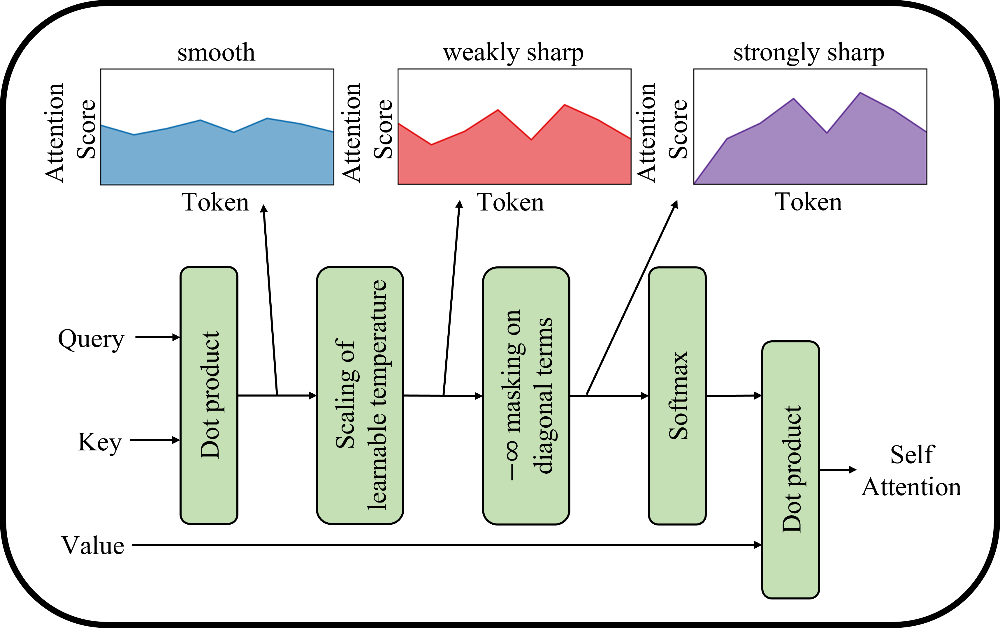

# Model description
Recently, the Vision Transformer (ViT), which applied the transformer structure to the image classification task, has outperformed convolutional neural networks.
However, the high performance of the ViT results from pre-training using a large-size dataset such as JFT-300M, and its dependence on a large dataset is interpreted as due to low locality inductive bias. 
This paper proposes Shifted Patch Tokenization (SPT) and Locality Self-Attention (LSA), which effectively solve the lack of locality inductive bias and enable it to learn from scratch even on small-size datasets.
Moreover I used a 2D sinusoidal positional embedding, global average pooling (no CLS token).

## Method
### Shifted Patch tokenization
<!-- <div align="center"> -->
  
<!-- </div> -->

### Locality Self Attention
<!-- <div align="center"> -->
  
<!-- </div> -->

## How to use
```python
python main.py --epochs 100 --height 32 --width 32 --patch_size 4 --depth 9 --heads 2 --dim 192 --mlp_dim 384 
```

## Results
The model was trained on CIFAR-10 for 100 epochs with cosine learning rate decay .The learning rate was set at 3e-4. batch size to 128.
1. Val Accuracy : 84.68%
2. Train Accuracy : 93.10%

## Citation
```
@article{lee2021vision,
  title={Vision Transformer for Small-Size Datasets},
  author={Lee, Seung Hoon and Lee, Seunghyun and Song, Byung Cheol},
  journal={arXiv preprint arXiv:2112.13492},
  year={2021}
}
```
